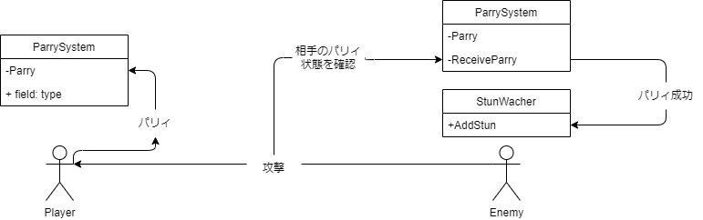

# オブジェクト構成
- パリィする側
  - [ParrySystem.cs](./ParrySystem.cs)

- パリィされる側
  - [ParrySystem.cs](./ParrySystem.cs)
  - [StunWatcher.cs](./スタン/StunWatcher.cs)
  - ◆ExecutionTrigger
    - VTriggerGenericAction.cs
      - OnPressActionInput()
        - vControlAIMelee.AddHealth(-100)
      - OnStartAnimation()
        - Executer.Execute
      - OnEndAnimation()
        - Executer.ControllPlayerCamera(false)
    - ◆MatchTarget

# 構成
