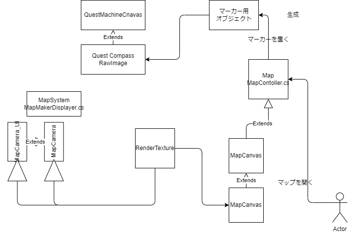

# オブジェクト構成
- プレイヤー
  - [MapSystem.cs](./MapSystem.cs)

- ◆MapSystem(予め配置する空オブジェクト)
  - [MapMakerDisplayer.cs](./MapMakerDisplayer.cs)
  - ◆MapCamera(Camera)
    - ◆MapCamera_UI(WorldMapレイヤー以外は表示しないOverlayCamera)
  - ◆MapInterfaceCanvas( マーカーなどを配置するCanvas)
    - ◆TargetIcon(Image)
  - ◆Location(エリア名をまとめたオブジェクト: Layer=WorldMap)
    - ◆Location(Canvas)
      - ◆Text(TextMeshPro)

- Map(地図プレハブ: Plane)
  - [MapController.cs](./MapController.cs)
  - MapCanvas(MapCamera映像を反映するCanvas)
    - MapImage(MapCamera映像を映すRawImage)

- (Quest Machine Canvas)
  - Quest Compass(RawImage)
    - [QuestCompass.cs](./QuestCompass.cs)

# 構成
